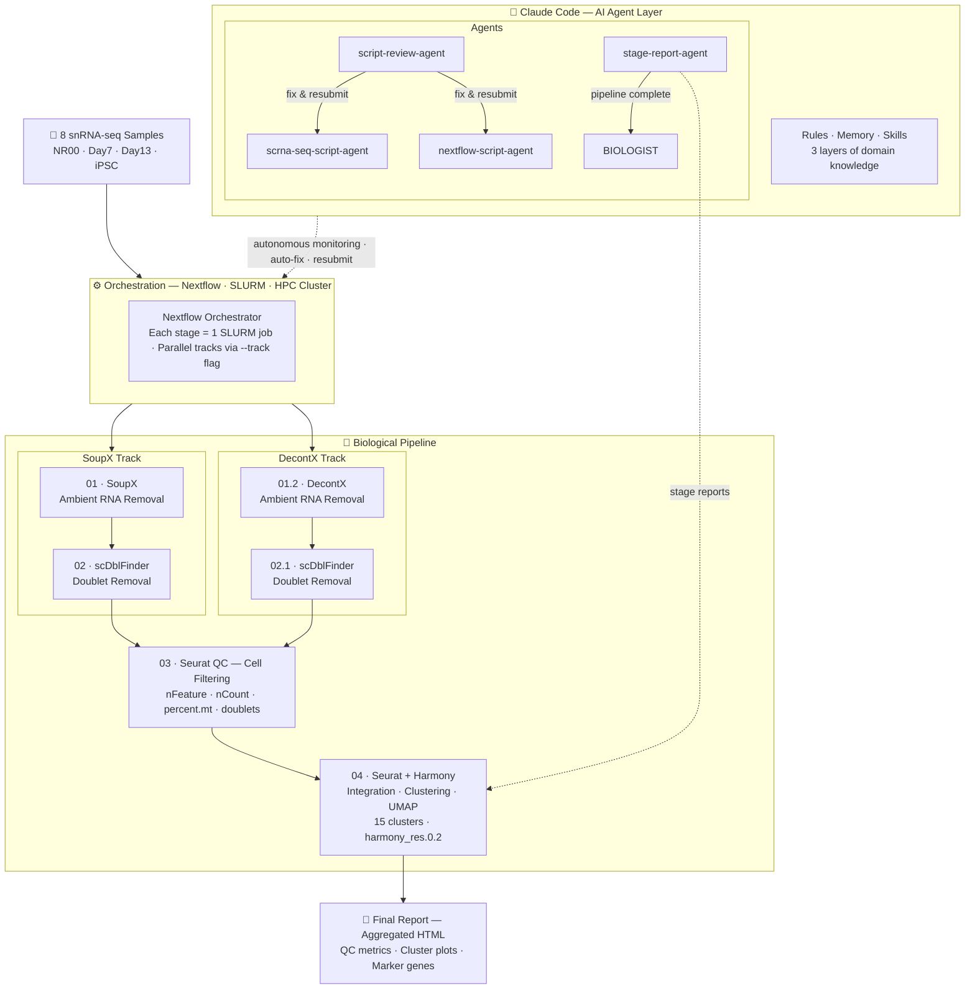

# iSN Claude — snRNA-seq Nextflow Pipeline

snRNA-seq analysis of human induced sensory neurons (iSNs), Stages 01–04: ambient RNA removal → doublet removal → cell filtering → clustering.


> Interactive view — drag to pan · scroll to zoom



---

## Requirements

- **HTCF cluster account** — all jobs run on HTCF via SLURM
- **Claude Code** — install from [Claude Code](https://code.claude.com/docs/en/quickstart)
- **Software dependencies** — see [md_files/SETUP.md](md_files/SETUP.md) for the full list. Mitra lab members on HTCF: already installed at `/ref/rmlab/software/`, no action needed.

---

## Getting Started

### 1. Clone the repo

```bash
git clone https://github.com/tyronchang1/NRP-iSN-snRNA-seq-Nextflow-pipeline
cd iSN_claude
```

### 2. Open in Claude Code

Start an interactive SLURM session, then open Claude Code:

```bash
srun --mem=24GB --cpus-per-task=1 -J interactive -p interactive --pty /bin/bash -l
claude
```

Claude automatically reads all rules, bootstraps your personal memory with the project behavioral rules, and checks pipeline status — no manual setup needed.

> [!IMPORTANT]
> **Type `start` as your first message at the beginning of every session.**
> This is a critical agent priming step — it loads all rules, skills, and project context into Claude before any work begins. Skipping it means agents may operate without the full behavioral ruleset. Claude will run the full session-start checklist step-by-step and announce each item so you can verify compliance.

### 3. Update paths and install R packages

> **STOP — update all paths before running anything.** Every file in `r_install/` has hardcoded paths pointing to Tyron's HTCF directories. Running without updating will fail silently or install to the wrong location.

**Easiest: let Claude do it.** In the Claude Code session you just opened, type:

```
Customize all paths and emails in r_install/ and the entire Nextflow pipeline for my HTCF account.
My R library path is: <your path>
My R binary path is:  <your path>
My email is:          <your email>

Also, install Java 17 and Nextflow in: <your path>
```

Claude updates every hardcoded path and email across `r_install/` and `nextflow/` in one pass. For manual path updates, see [md_files/SETUP.md](md_files/SETUP.md).

Once paths are updated, run the install from the same interactive session:

```bash
bash r_install/submit_all.sh
```

This submits 5 jobs in dependency order (CRAN → Bioconductor → GitHub → Python → Pandoc). Takes several hours. Monitor with `squeue -u $USER`. If any stage fails, re-run the same command — it skips already-installed packages.

Full package list: [md_files/PACKAGES.md](md_files/PACKAGES.md)

### 4. Run the pipeline

Once install is complete, open a new interactive SLURM session and run:

```bash
srun --mem=24GB --cpus-per-task=1 -J interactive -p interactive --pty /bin/bash -l
bash nextflow/submit.sh
```

`submit.sh` prompts for track (`SoupX` or `DecontX`) and gene sets, then submits to SLURM. You will receive an email at job start, end, and failure.

### 5. Check results

Once the job finishes, Claude automatically reports per-stage status and spawns the BIOLOGIST agent to review outputs. Final outputs are in `final_output/`.

---

## Pipeline Stages

Two parallel tracks (SoupX and DecontX) run through four stages:

| Stage | Purpose |
|-------|---------|
| 01 / 01.2 | Ambient RNA removal |
| 02 / 02.1 | Doublet removal |
| 03 | Cell QC filtering |
| 04 | Integration + clustering |

See [md_files/PIPELINE.md](md_files/PIPELINE.md) for scripts, tools, and track details.

---

## Agent Behavior

Claude enforces 11 behavioral rules every session — no inline script edits, autonomous SLURM, pipeline monitoring every 30 min, and more. See [md_files/SETUP.md](md_files/SETUP.md) for the full rules table and how the memory bootstrap works.

---

## Credits

The `grill-with-docs` skill is adapted from [Matt Pocock's skills library](https://github.com/mattpocock/skills/tree/main/skills/engineering/grill-with-docs).

The principles in `.claude/rules/01_principles.md` are adapted from [Andrej Karpathy](https://karpathy.ai/).
