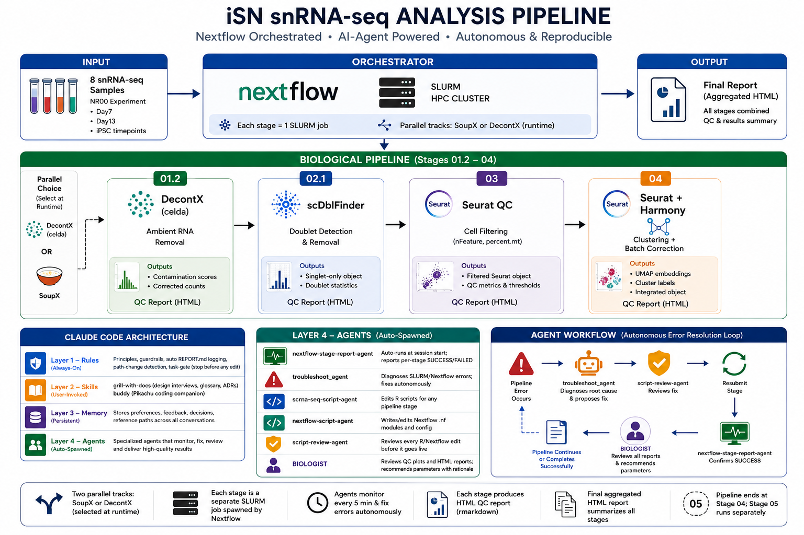

# iSN Claude — snRNA-seq Nextflow Pipeline

snRNA-seq analysis of human induced sensory neurons (iSNs), Stages 01–04: ambient RNA removal → doublet removal → cell filtering → clustering.



---

## Requirements

- **HTCF cluster account** — all compute jobs run on HTCF via SLURM. You need an account and access to the `interactive` partition.
- **Claude Code** — install from [Claude Code](https://code.claude.com/docs/en/quickstart). This is what runs the agents, applies the rules, and manages the pipeline for you.
- **Software dependencies** — the following must be installed and accessible before running the R package install scripts. If you are in the rmlab group on HTCF, these are already at `/ref/rmlab/software/` and the default paths will work. If you are on a different HTCF lab account or a different cluster, install them in your own lab's software directory and update the paths in step 2.

  **Must install yourself** (paths set in `r_install/01_cran.sh` lines 27–42):

  | Tool / library | Used by |
  |----------------|---------|
  | R 4.5.2 | all pipeline scripts |
  | Java 17 | Nextflow |
  | Nextflow | pipeline orchestration |
  | conda / miniconda | `05_pandoc.sh` — pandoc for report rendering |
  | fontconfig | font rendering (ragg, Cairo) |
  | cairo | 2D graphics (R graphics device) |
  | HarfBuzz, FriBidi | text shaping (ragg) |
  | libX11, xorgproto | X11 headers (R graphics) |
  | libraqm, liblqr | text layout + liquid rescale (ragg, magick) |
  | libtiff, libjpeg, libwebp | image formats (magick R package) |
  | ImageMagick | image processing (magick R package) |
  | HDF5 | Seurat HDF5 support |
  | GDAL, GEOS, PROJ | spatial R packages |
  | FFTW3 | `qqconf` Bioconductor package |
  | udunits2 | `units` R package |
  | ODBC libraries | database connectivity |

  **Provided via spack** (already at `/ref/rmlab/software/spack-1.1.0/` on HTCF — no action needed unless on a different cluster):

  | Tool / library | Used by |
  |----------------|---------|
  | OpenSSL | curl, HTTPS downloads |
  | curl, nghttp2 | R package downloads |
  | libpng, freetype | graphics / font rendering |
  | libxml2 | XML parsing (many R packages) |
  | zlib, bzip2, xz, libiconv | compression / encoding |
  | cmake | compiling packages from source |

---

## Getting Started

### 1. Clone the repo

```bash
git clone <repo-url>
cd iSN_claude
```

### 2. Install R packages

> **STOP — update paths before running anything.**
> Every file in `r_install/` contains hardcoded paths that point to Tyron's directories on HTCF. Running `submit_all.sh` without updating them will fail silently or install packages to the wrong location. Complete all four path-update sections below before running any install script.

Before running the install scripts, update all paths and email for your account.

**Recommended: let Claude do it for you.** Install [Claude Code](https://code.claude.com/docs/en/quickstart) in your local computer, then open it in the repo root:

```bash
cd iSN_claude
claude
```

Then type this prompt:

```
Customize all paths and and email in r_install/ and the entire Nextflow pipeline for my HTCF account.
My R library path is: <your path>
My R binary path is:  <your path>
My email is:          <your email>

Also, install Java 17 and NEXTFLOW in : <your path>
```

Claude will find every hardcoded path and email across `r_install/` and `nextflow/` and update them in one pass. Alternatively, use the table below to update them manually.

#### R library and binary paths — update in 4 files

| What | File | Line | Old value |
|------|------|------|-----------|
| R package library | `r_install/01_cran.sh` | 12 | `export R_LIBS=/ref/rmlab/software/tyron/R-libs` |
| R package library | `r_install/02_bioc.sh` | 12 | same |
| R package library | `r_install/03_github.sh` | 12 | same |
| R package library | `nextflow/nextflow.config` | 4 | `r_libs = "/ref/rmlab/software/tyron/R-libs"` |
| R binary | `r_install/01_cran.sh` | 10 | `R_BIN=/ref/rmlab/software/spack-1.1.0/.../bin` |
| R binary | `r_install/02_bioc.sh` | 10 | same |
| R binary | `r_install/03_github.sh` | 10 | same |
| R binary | `nextflow/nextflow.config` | 3 | `r_bin = "/ref/rmlab/software/spack-1.1.0/.../bin"` |

#### Nextflow runtime paths — update in 3 files

| What | File | Line | Old value |
|------|------|------|-----------|
| Nextflow home dir | `nextflow/run.sh` | 14 | `NXF_HOME=/scratch/rmlab/rmlab_shared3/tyron/.nextflow` |
| Nextflow binary | `nextflow/run.sh` | 16 | `NXF_BIN=/ref/rmlab/software/tyron/nextflow` |
| Java home | `nextflow/run.sh` | 12 | `JAVA_HOME=/ref/rmlab/software/tyron/java17` |
| Email notifications | `nextflow/run.sh` | 10 | `#SBATCH --mail-user=tyron@wustl.edu` |
| Nextflow home dir | `nextflow/submit.sh` | 5 | `export NXF_HOME=/scratch/rmlab/rmlab_shared3/tyron/.nextflow` |
| Pandoc (for reports) | `nextflow/nextflow.config` | 72 | `RSTUDIO_PANDOC = "/home/tyron/miniconda3/bin"` |

> `NXF_HOME` must be the same value in both `run.sh` and `submit.sh` — they use it to pass gene set inputs between the two scripts.

#### Python and Pandoc install paths — update in 2 files

| What | File | Line | Old value |
|------|------|------|-----------|
| Python binary | `r_install/04_python.sh` | 10 | `PYTHON=/home/tyron/miniconda3/bin/python3` |
| pip binary | `r_install/04_python.sh` | 11 | `PIP=/home/tyron/miniconda3/bin/pip3` |
| Python package dir | `r_install/04_python.sh` | 12 | `PY_TARGET=/ref/rmlab/software/tyron/python-libs` |
| conda binary | `r_install/05_pandoc.sh` | 10 | `CONDA=/home/tyron/miniconda3/bin/conda` |
| conda prefix | `r_install/05_pandoc.sh` | 11 | `CONDA_PREFIX=/home/tyron/miniconda3` |

#### System library paths — `r_install/01_cran.sh`, `02_bioc.sh`, `03_github.sh` (lines 27–42)

These scripts link against compiled C libraries (fontconfig, cairo, HDF5, GDAL, etc.) located under `/ref/rmlab/software/tyron/`. You will need to install these libraries yourself and update the `*_DIR` variables in each script.

#### Full package list — all packages installed by `submit_all.sh`

Every package below is required. The install scripts handle dependencies automatically.

**CRAN** (`r_install/01_cran.sh`)

| Package | Purpose |
|---------|---------|
| Seurat | scRNA-seq analysis (all stages) |
| SoupX | Ambient RNA removal (Stage 01) |
| scCustomize | Seurat plotting extensions |
| cowplot | Multi-panel plot composition |
| ggplot2 | Plotting |
| ggrepel | Non-overlapping plot labels |
| patchwork | Plot layout |
| viridis | Color scales |
| pheatmap | Heatmaps |
| ggpubr | Publication-ready ggplot2 helpers |
| ggdendro | Dendrogram plotting |
| clustree | Clustering resolution trees |
| magick | Image processing |
| RColorBrewer | Color palettes |
| randomcoloR | Random color generation |
| gt | Table formatting |
| dplyr | Data manipulation |
| tidyr | Data tidying |
| purrr | Functional programming |
| tibble | Modern data frames |
| stringr | String manipulation |
| forcats | Factor manipulation |
| readr | Data import |
| scales | Axis/color scaling |
| lubridate | Date handling |
| broom | Model output tidying |
| Matrix | Sparse matrix support |
| RSpectra | Sparse SVD for PCA (Stage 04) |
| future | Parallel processing |
| data.table | Fast tabular operations |
| magrittr | Pipe operator |
| glue | String interpolation |
| gridExtra | Grid graphics |
| tictoc | Timing |
| R.utils | Utility functions |
| msigdbr | MSigDB gene sets |
| RobustRankAggreg | Robust rank aggregation |
| reticulate | Python interop |
| shiny | Interactive apps |
| DT | Interactive tables |
| knitr | Report rendering |
| rmarkdown | R Markdown documents |
| markdown | Markdown rendering |
| here | Relative paths |
| lintr | Linting |
| styler | Code formatting |
| BiocManager | Bioconductor install manager |
| remotes | GitHub package installer |
| pak | Fast package installer |
| callback | Callback utilities |

**Bioconductor** (`r_install/02_bioc.sh`)

| Package | Purpose |
|---------|---------|
| DropletUtils | Write corrected 10x count matrices (Stage 01) |
| scDblFinder | Doublet detection (Stages 02, 02.1) |
| AUCell | Gene set activity scoring (Stage 04) |
| glmGamPoi | Fast GLM fitting (Seurat SCTransform) |
| miloR | Differential abundance testing |
| SingleCellExperiment | SCE container (scDblFinder input) |
| SummarizedExperiment | Base Bioc container |
| multtest | Multiple testing correction |
| celda | Decontamination (decontX dependency) |
| scater | Single-cell utilities |
| scran | Single-cell normalization |
| ComplexHeatmap | Advanced heatmaps |
| UCell | Gene set scoring |
| zellkonverter | AnnData ↔ SCE conversion |
| DESeq2 | Differential expression |
| edgeR | Differential expression |
| limma | Linear models for genomics |
| apeglm | Log fold change shrinkage |
| clusterProfiler | Gene ontology enrichment |
| ReactomePA | Reactome pathway analysis |
| AnnotationDbi | Annotation databases |
| org.Hs.eg.db | Human gene annotation |
| org.Mm.eg.db | Mouse gene annotation |
| GSVA | Gene set variance analysis |
| BiocGenerics | Bioc generic functions |
| BiocParallel | Bioc parallel framework |
| S4Vectors | S4 vector classes |
| DelayedArray | Delayed array operations |
| DelayedMatrixStats | Stats on delayed matrices |
| HDF5Array | HDF5-backed arrays |
| batchelor | Batch correction |
| Biobase | Base Bioc classes |
| TOAST | Cell type deconvolution |
| singleCellTK | Single-cell toolkit |
| scry | Null residuals for scRNA-seq |
| Rhtslib | HTSlib for BAM/CRAM |
| monocle | Trajectory analysis (v2) |

**GitHub** (`r_install/03_github.sh`)

| Package | GitHub repo | Purpose |
|---------|-------------|---------|
| harmony | immunogenomics/harmony | Batch correction (Stage 04) |
| presto | immunogenomics/presto | Fast Wilcoxon / FindAllMarkers |
| SeuratDisk | mojaveazure/seurat-disk | H5Seurat read/write |
| decontX | campbio/decontX | Ambient RNA removal (Stage 01.2) |
| BPCells | bnprks/BPCells/r | Out-of-core matrix operations |
| DoubletFinder | chris-mcginnis-ucsf/DoubletFinder | Alternative doublet detection |
| monocle3 | cole-trapnell-lab/monocle3 | Trajectory analysis (v3) |
| SeuratWrappers | satijalab/seurat-wrappers | Seurat integration wrappers |
| SeuratData | satijalab/seurat-data | Reference datasets |
| scSHC | igrabski/sc-SHC | Statistical cluster validation |
| scclusteval | crazyhottommy/scclusteval | Clustering stability evaluation |
| scGSVA | guokai8/scGSVA | Gene set scoring for scRNA-seq |
| garnett | cole-trapnell-lab/garnett | Cell type classification |
| ShinyCell2 | the-ouyang-lab/ShinyCell2 | Shiny app for scRNA-seq |
| EPIC | GfellerLab/EPIC | Cell type deconvolution |
| MuSiC | xuranw/MuSiC | Bulk deconvolution |
| xbioc | renozao/xbioc | MuSiC dependency |
| MuSiC2 | Jiaxin-Fan/MuSiC2 | Improved bulk deconvolution |

**Python** (`r_install/04_python.sh`)

| Package | Purpose |
|---------|---------|
| numpy | Numerical arrays |
| pandas | DataFrames |
| scipy | Scientific computing |
| scikit-learn | Machine learning utilities |
| anndata | AnnData container (scverse) |
| scanpy | Python scRNA-seq analysis |

---

Once all paths are updated, start an interactive session and submit the install jobs:

```bash
# 1. Start an interactive SLURM session
srun --mem=24GB --cpus-per-task=1 -J interactive -p interactive --pty /bin/bash -l

# 2. From the project root, run the install script directly (not via sbatch)
bash r_install/submit_all.sh
```

This submits five SLURM jobs in dependency order (CRAN → Bioconductor → GitHub → Python, Pandoc). The full install takes several hours. Monitor progress with:

```bash
squeue -u $USER
tail -f r_install/logs/01_cran_<jobid>.out
```

Check logs in `r_install/logs/` when done. If any stage fails, re-run `bash r_install/submit_all.sh` — it safely skips already-installed packages and retries only what failed.

### 3. Open in Claude Code

```bash
claude
```

On your **first session**, Claude automatically:
- Reads all rules from `.claude/rules/`
- Writes the project behavioral rules to your personal memory (see [Agent Behavior](#agent-behavior) below)
- Checks pipeline status and reports any in-progress or failed jobs

No manual setup required.

### 4. Run the pipeline

From the project root, in an **interactive terminal** (not via sbatch):

```bash
bash nextflow/submit.sh
```

`submit.sh` will prompt you for:
1. **Track** — `SoupX` or `DecontX` (which ambient RNA removal method to use for downstream stages)
2. **Gene sets** — choose from predefined iSN marker sets or enter custom genes

It then submits the pipeline to SLURM. You will receive an email at job end/fail.

### 5. Check results

Once the job finishes, Claude will automatically report per-stage status and spawn the BIOLOGIST agent to review the outputs. Final outputs are in `final_output/`.

---

## Pipeline Stages

Both tracks run in parallel. Stages 03–04 can use either track's output.

| Stage | Tool | Track | Script |
|-------|------|-------|--------|
| 01 — Ambient RNA removal | SoupX | SoupX | `scripts/01_SoupX/SoupX_{SAMPLE}.R` |
| 01.2 — Ambient RNA removal | DecontX | DecontX | `scripts/01.2_DecontX/01.2_DecontX.R` |
| 02 — Doublet removal | scDblFinder | SoupX | `scripts/02_scDblFinder_soupx/02_scDblFinder_soupx.R` |
| 02.1 — Doublet removal | scDblFinder | DecontX | `scripts/02.1_scDblFinder_decontX/02.1_scDblFinder_decontX.R` |
| 03 — Cell filtering | Seurat | Both | `scripts/03_Cell_filtering/03_cell_filtering.R` |
| 04 — Clustering | Seurat + Harmony | Both | `scripts/04_Clustering/04_clustering.R` |

---

## Credits

The `grill-with-docs` skill used in this project is adapted from [Matt Pocock's skills library](https://github.com/mattpocock/skills/tree/main/skills/engineering/grill-with-docs). It drives the interview-style questioning that Claude uses before any script edit to surface design decisions and terminology conflicts before touching code.

---

## Agent Behavior

This repo ships with Claude Code agents, rules, and skills that give Claude consistent behavior across sessions and users. When you clone and open the project in Claude Code, the following happens automatically on your first session:

1. Claude reads `.claude/rules/07_behavior.md` — the authoritative behavioral rule file
2. Claude reads `.claude/memory/project_behavior_rules.md` — the repo-committed template
3. Claude checks your personal memory directory: `~/.claude/projects/<hash>/memory/`
4. The file does not exist yet → Claude writes it to your memory directory
5. Claude adds a pointer to your `MEMORY.md` index
6. Every subsequent session: file already exists → this step is skipped

This means the 11 behavioral rules are in your personal Claude memory from session one — no manual setup needed.

### What the rules enforce

| # | Rule |
|---|------|
| 1 | No inline edits to `.R` or `.nf` files — always route through the correct agent |
| 2 | SLURM is fully autonomous — Claude runs `sbatch`/`scancel` itself, never asks you |
| 3 | Pipeline monitoring — Claude checks logs every 30 min and fixes errors without asking |
| 4 | Every agent spawn includes a mandatory user-constraints block |
| 5 | Troubleshooting always starts by reading `compact/`, `r_install/`, `r_install/logs/` |
| 6 | Claude announces any file it reads that you didn't explicitly reference |
| 7 | Claude grills you with one question at a time before editing any script |
| 8 | Pipeline ends at Stage 04 — Stage 05 is removed and will never be suggested |
| 9 | `WORKFLOW.md` is for R agents; `NEXTFLOW.md` is for the Nextflow agent |
| 10 | `SKILL.md` files are agent instructions, not slash commands |
| 11 | Any file rename, delete, or path change triggers a project-wide reference update |

---

## Directory Structure

```
iSN_claude/
├── CLAUDE.md                        Claude Code instructions and project overview
├── README.md                        This file
│
├── samples/                         Raw Cell Ranger outputs (input data, read-only)
│   ├── NR00_Day13_1/                Differentiation day 13, replicate 1
│   ├── NR00_Day13_1_dup/            Differentiation day 13, replicate 1 (duplicate run)
│   ├── NR00_Day13_2/                Differentiation day 13, replicate 2
│   ├── NR00_Day13_2_dup/            Differentiation day 13, replicate 2 (duplicate run)
│   ├── NR00_Day7_1/                 Differentiation day 7, replicate 1
│   ├── NR00_Day7_2/                 Differentiation day 7, replicate 2
│   ├── NR00_iPSC_1/                 Undifferentiated iPSC control, replicate 1
│   └── NR00_iPSC_2/                 Undifferentiated iPSC control, replicate 2
│
├── scripts/                         Analysis R scripts — one subdirectory per pipeline stage
│   ├── 01_SoupX/
│   ├── 01.2_DecontX/
│   ├── 02_scDblFinder_soupx/
│   ├── 02.1_scDblFinder_decontX/
│   ├── 03_Cell_filtering/
│   └── 04_Clustering/
│
├── final_output/                    Final pipeline outputs (written after Stage 04)
│   ├── final_report.Rmd             R Markdown source for the merged pipeline report
│   ├── final_report_decontX.html    Rendered pipeline report — DecontX track
│   └── Biologist_Chat.md            BIOLOGIST agent review log
│
├── r_install/                       SLURM scripts for installing R/Python packages on HTCF
│   ├── submit_all.sh                Run this once: submits all install jobs in dependency order
│   ├── 01_cran.sh / 02_bioc.sh / 03_github.sh / 04_python.sh
│   └── logs/                        SLURM install logs
│
├── nextflow/                        Nextflow DSL2 pipeline
│   ├── submit.sh                    ENTRY POINT — bash nextflow/submit.sh
│   ├── run.sh                       SLURM batch script (submitted by submit.sh — do not run directly)
│   ├── main.nf                      Main workflow
│   ├── nextflow.config              Params, executor, and resource settings
│   ├── REPORT.md                    Execution logs and error history
│   ├── logs/                        SLURM stdout/stderr for the Nextflow head job
│   └── modules/                     One .nf file per pipeline stage
│
├── md_files/                        Pipeline documentation (agent-facing)
│   ├── WORKFLOW.md                  R pipeline reference for scrna-seq-script-agent
│   ├── NEXTFLOW.md                  Nextflow reference for nextflow-script-agent
│   ├── STATUS.md                    Per-stage implementation status
│   └── REPORT.md                    Change log for all .claude/ and md_files/ edits
│
├── compact/                         Session compact logs (written on every context compaction)
│
└── .claude/                         Claude Code configuration
    ├── memory/                      Repo-committed memory templates
    │   └── project_behavior_rules.md  Seeded into user's personal memory on first session. this will be copy and paste into ~/.claude/project/<hash>/memory
    ├── rules/                       7 rule files — read at every session start
    ├── agents/                      6 custom agents (scrna-seq, nextflow, review, report, troubleshoot, biologist)
    └── skills/                      Stage-specific agent instruction files (SKILL.md per stage)
```
